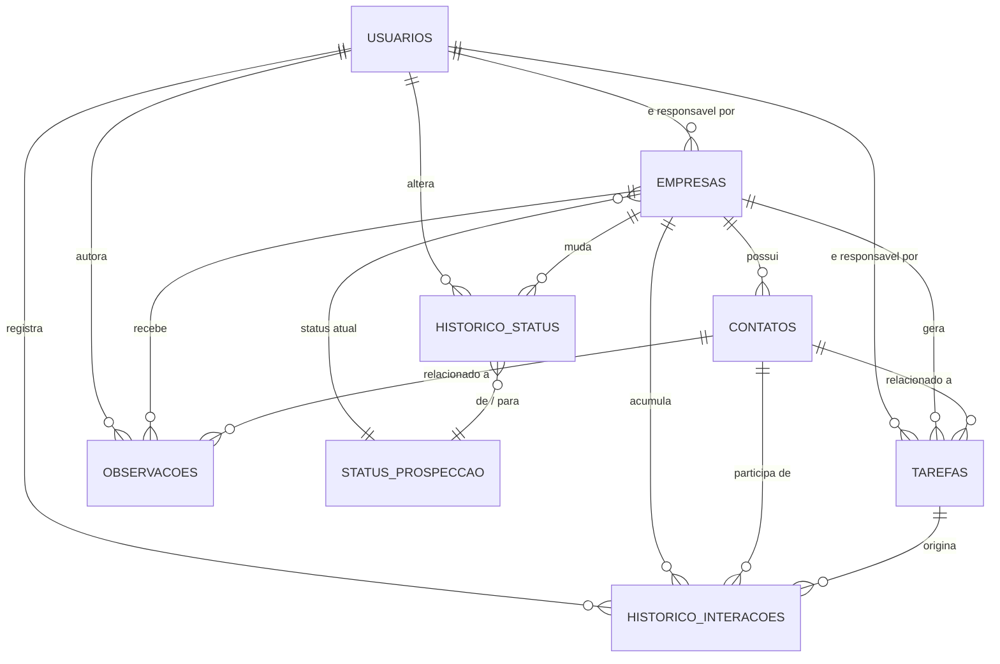

# Data Model — CRM Interno 2Pak Studio

**Versão:** 1.0
**Status:** Modelagem conceitual (pré-implementação)
**Autor:** Arquitetura de Dados — 2Pak Studio

---

## 1. Visão Geral

Este documento descreve a modelagem de dados do CRM interno da 2Pak Studio, responsável por registrar empresas prospectadas, contatos realizados, status de prospecção, observações da equipe, tarefas de follow-up e o histórico completo de interações com cada lead/cliente.

A modelagem segue três princípios:

1. **Normalização com propósito** — evitar redundância e inconsistência, mas sem über-normalizar a ponto de prejudicar performance de leitura.
2. **Catálogos em vez de valores fixos** — campos como "status" e "tipo de interação" são tabelas próprias, não strings fixas no código, permitindo evolução do funil sem deploy.
3. **Auditabilidade desde o dia 1** — toda entidade carrega quem criou/alterou e quando, e mudanças de status geram histórico, não apenas sobrescrita.

Além das entidades solicitadas, foi incluída a entidade de apoio **Usuários**, pois é referenciada por praticamente todas as outras (quem é responsável pela empresa, quem registrou a interação, quem criou a tarefa). Sem ela, a rastreabilidade do CRM fica comprometida.

---

## 2. Diagrama Conceitual (Entidade-Relacionamento)

---

## 3. Entidades

### 3.1 Usuários *(entidade de apoio)*

Representa os membros da equipe da agência (SDRs, Account Managers, gestores) que operam o CRM. Não foi pedida explicitamente, mas é pré-requisito para qualquer rastreabilidade de "quem fez o quê".

| Campo | Tipo | Descrição |
|---|---|---|
| id | UUID (PK) | Identificador único do usuário |
| nome | VARCHAR | Nome completo |
| email | VARCHAR (único) | Usado também para login |
| papel | VARCHAR / FK catálogo | Ex: SDR, Account Manager, Gestor, Admin |
| ativo | BOOLEAN | Soft delete / desativação de acesso |
| data_criacao | TIMESTAMP | Auditoria |

---

### 3.2 Empresas

Entidade central do CRM. Representa cada empresa prospectada, em qualquer estágio do funil — de lead frio a cliente fechado.

| Campo | Tipo | Descrição |
|---|---|---|
| id | UUID (PK) | Identificador único |
| nome_fantasia | VARCHAR | Nome usado no dia a dia |
| razao_social | VARCHAR (nullable) | Nome jurídico, se disponível |
| cnpj | VARCHAR (nullable, único) | Documento da empresa, quando conhecido |
| segmento | VARCHAR / FK catálogo | Setor de atuação (e-commerce, saúde, educação...) |
| porte | ENUM/catálogo | Micro, pequena, média, grande |
| site | VARCHAR (nullable) | URL institucional |
| origem_lead | VARCHAR / FK catálogo | Indicação, inbound, outbound, evento, redes sociais |
| responsavel_id | UUID (FK → Usuários) | Account Manager/SDR responsável pela conta |
| status_atual_id | UUID (FK → Status de Prospecção) | Posição atual no funil |
| ativo | BOOLEAN | Soft delete |
| data_criacao / data_atualizacao | TIMESTAMP | Auditoria |

> **Nota de modelagem:** endereço completo (logradouro, cidade, UF, CEP) pode viver em uma tabela `enderecos` separada caso a agência venha a operar com múltiplos endereços por empresa (matriz/filiais) ou precise de dados estruturados para geolocalização. Por ora, pode começar como campos simples dentro de Empresas.

---

### 3.3 Contatos

Pessoas físicas dentro de uma empresa com quem a agência efetivamente conversa. Uma empresa pode (e normalmente deve) ter mais de um contato — quem assina o contrato raramente é quem responde o WhatsApp.

| Campo | Tipo | Descrição |
|---|---|---|
| id | UUID (PK) | Identificador único |
| empresa_id | UUID (FK → Empresas) | A qual empresa este contato pertence |
| nome | VARCHAR | Nome do contato |
| cargo | VARCHAR (nullable) | Cargo na empresa |
| email | VARCHAR (nullable) | |
| telefone / whatsapp | VARCHAR (nullable) | |
| linkedin_url | VARCHAR (nullable) | |
| contato_principal | BOOLEAN | Marca o decisor/ponto focal preferencial |
| ativo | BOOLEAN | Soft delete (ex: contato saiu da empresa) |
| data_criacao | TIMESTAMP | Auditoria |

---

### 3.4 Status de Prospecção *(tabela de catálogo)*

Em vez de gravar o status como texto livre dentro de "Empresas", ele vira uma tabela própria. Isso permite reordenar o funil, mudar nomes/cores no Kanban e adicionar etapas sem alterar código.

| Campo | Tipo | Descrição |
|---|---|---|
| id | UUID (PK) | Identificador único |
| nome | VARCHAR | Ex: Novo Lead, Qualificação, Proposta Enviada, Negociação, Ganho, Perdido |
| ordem_funil | INT | Define a posição visual/lógica no funil |
| cor_hex | VARCHAR (nullable) | Uso em dashboards/Kanban |
| ativo | BOOLEAN | Permite "desativar" etapas antigas sem apagar histórico |

---

### 3.5 Histórico de Status

Toda mudança de status gera um registro aqui — a tabela "Status de Prospecção" guarda apenas o estado *atual*; esta tabela guarda a *trajetória*. Essencial para calcular tempo médio em cada etapa do funil, taxa de conversão e detectar leads "esquecidos".

| Campo | Tipo | Descrição |
|---|---|---|
| id | UUID (PK) | Identificador único |
| empresa_id | UUID (FK → Empresas) | Empresa que mudou de status |
| status_anterior_id | UUID (FK, nullable) | Nulo no primeiro registro (entrada no funil) |
| status_novo_id | UUID (FK → Status de Prospecção) | Novo status assumido |
| usuario_id | UUID (FK → Usuários) | Quem fez a alteração |
| motivo | TEXT (nullable) | Ex: "Cliente sem orçamento neste trimestre" |
| data_alteracao | TIMESTAMP | Quando ocorreu |

---

### 3.6 Observações

Anotações livres da equipe sobre uma empresa ou um contato específico — informações qualitativas que não cabem em campos estruturados ("o financeiro só aprova depois do dia 10", "prefere ser contatado por e-mail").

| Campo | Tipo | Descrição |
|---|---|---|
| id | UUID (PK) | Identificador único |
| empresa_id | UUID (FK → Empresas) | Empresa relacionada |
| contato_id | UUID (FK → Contatos, nullable) | Preenchido se a observação for sobre uma pessoa específica |
| usuario_id | UUID (FK → Usuários) | Autor da observação |
| conteudo | TEXT | Texto livre |
| data_criacao / data_atualizacao | TIMESTAMP | Auditoria |

---

### 3.7 Tarefas

Ações futuras agendadas: ligar de volta, enviar proposta, confirmar reunião. É o motor de follow-up do CRM.

| Campo | Tipo | Descrição |
|---|---|---|
| id | UUID (PK) | Identificador único |
| empresa_id | UUID (FK → Empresas) | Empresa relacionada |
| contato_id | UUID (FK → Contatos, nullable) | Pessoa específica envolvida, se aplicável |
| titulo | VARCHAR | Ex: "Enviar proposta comercial" |
| descricao | TEXT (nullable) | Detalhes adicionais |
| tipo | VARCHAR / FK catálogo | Ligação, e-mail, reunião, follow-up, proposta |
| prioridade | ENUM | Baixa, média, alta |
| status | ENUM | Pendente, em andamento, concluída, cancelada |
| data_vencimento | TIMESTAMP | Quando deve ser feita |
| data_conclusao | TIMESTAMP (nullable) | Preenchido ao concluir |
| responsavel_id | UUID (FK → Usuários) | Quem deve executar |
| criado_por_id | UUID (FK → Usuários) | Quem criou a tarefa (pode ser outro usuário, ex: um gestor delegando) |
| data_criacao | TIMESTAMP | Auditoria |

---

### 3.8 Histórico de Interações

O log definitivo de todo contato real com o lead/cliente: ligações, e-mails, reuniões, mensagens. É diferente de "Tarefas" (que é o *planejado*) — aqui fica o que *de fato aconteceu*.

| Campo | Tipo | Descrição |
|---|---|---|
| id | UUID (PK) | Identificador único |
| empresa_id | UUID (FK → Empresas) | Empresa relacionada |
| contato_id | UUID (FK → Contatos, nullable) | Pessoa com quem a interação ocorreu |
| usuario_id | UUID (FK → Usuários) | Quem registrou/realizou a interação |
| tipo_interacao | VARCHAR / FK catálogo | Ligação, e-mail, WhatsApp, reunião, visita, redes sociais |
| resumo | TEXT | O que foi conversado/decidido |
| resultado | VARCHAR / FK catálogo | Interessado, sem resposta, agendado, recusado, etc. |
| tarefa_origem_id | UUID (FK → Tarefas, nullable) | Caso a interação tenha nascido de uma tarefa agendada |
| data_interacao | TIMESTAMP | Quando ocorreu de fato |

---

## 4. Relacionamentos e Cardinalidade

| Relação | Cardinalidade | Observação |
|---|---|---|
| Usuário → Empresas | 1:N | Um usuário gerencia várias contas; uma empresa tem um responsável principal |
| Empresa → Contatos | 1:N | Uma empresa tem vários contatos; um contato pertence a uma única empresa |
| Empresa → Status de Prospecção | N:1 | Várias empresas podem estar no mesmo status; cada empresa tem um único status atual |
| Empresa → Histórico de Status | 1:N | Cada mudança de status gera um novo registro, nunca sobrescreve |
| Empresa → Observações | 1:N | Várias observações por empresa |
| Contato → Observações | 1:N (opcional) | Observação pode ou não estar amarrada a um contato específico |
| Empresa/Contato → Tarefas | 1:N (opcional para contato) | Tarefa sempre tem empresa; contato é opcional |
| Empresa/Contato → Histórico de Interações | 1:N (opcional para contato) | Toda interação pertence a uma empresa; contato é opcional |
| Tarefa → Histórico de Interações | 1:N (opcional) | Uma tarefa cumprida pode originar um registro de interação |

**Por que "contato_id" é opcional em várias tabelas:** nem toda observação, tarefa ou interação é sobre uma pessoa específica — às vezes é sobre a empresa como um todo (ex: "empresa passou por fusão, revisar todos os contatos").

---

## 5. Decisões de Modelagem e Justificativas

**Catálogos em vez de enums fixos no código** — Status de Prospecção e os tipos de interação/tarefa são tabelas, não valores fixos. Isso permite que a operação evolua o funil de vendas sem depender de deploy de código, e possibilita métricas por etapa (tempo médio, taxa de conversão) de forma nativa.

**Histórico separado do estado atual** — Em vez de só atualizar `status_atual_id` na empresa, cada mudança gera uma linha em Histórico de Status. O custo é uma tabela extra; o ganho é poder reconstruir a jornada completa de qualquer lead e gerar relatórios de funil sem depender de logs de aplicação.

**Tarefas vs. Histórico de Interações como entidades distintas** — Tarefa é *planejamento* (o que deve acontecer); Interação é *fato* (o que aconteceu). Separar os dois evita que o histórico fique poluído com itens nunca realizados, e permite medir taxa de cumprimento de tarefas.

**IDs como UUID, não inteiro sequencial** — Evita exposição de volume de dados (ex: "empresa #4" revela que só há 4 empresas), facilita merges entre ambientes (dev/staging/produção) e é mais seguro para uma futura API pública ou integração externa.

---

## 6. Escalabilidade e Performance

**Índices** — Índices compostos em todas as foreign keys (`empresa_id`, `contato_id`, `usuario_id`) e em campos de busca frequente (`nome` de empresa, `cnpj`, `email` de contato). Para volumes grandes, considerar índice de texto completo (full-text search) em `observacoes.conteudo` e `historico_interacoes.resumo`.

**Crescimento de Histórico de Interações** — Esta é a tabela com maior tendência a crescer indefinidamente (uma linha por ligação/e-mail/reunião, multiplicada pelo número de empresas ativas). Recomenda-se monitorar o volume e, quando necessário, particionar por data (ex: partição mensal ou trimestral) para manter consultas rápidas sobre o período recente sem descartar dados antigos.

**Soft delete em vez de exclusão física** — Empresas, contatos e usuários usam um campo `ativo`/`deleted_at` em vez de `DELETE`. Isso preserva integridade referencial do histórico (uma interação antiga continua "amarrada" a um contato que saiu da empresa) e permite auditoria futura.

**Timestamps de auditoria em todas as tabelas** — `data_criacao` e, onde aplicável, `data_atualizacao`, presentes desde o desenho inicial. É bem mais caro adicionar isso depois do sistema em produção do que prever agora.

**Separação entre dados operacionais e analíticos** — Conforme o volume de dados crescer, dashboards de funil de vendas (ex: "tempo médio em cada etapa", "taxa de conversão por origem de lead") devem ser servidos por views materializadas ou um banco analítico replicado, evitando que relatórios pesados concorram com a operação diária do CRM.

**Multi-tenant como possibilidade futura** — Se a 2Pak Studio vier a oferecer este CRM como produto para outras agências/clientes (não apenas uso interno), recomenda-se já reservar um campo `tenant_id` ou `organizacao_id` em todas as tabelas principais desde já, mesmo que hoje tenha um valor único fixo. Adicionar isso retroativamente em uma base grande é uma migração cara.

---

## 7. Considerações de Privacidade (LGPD)

As entidades Contatos e, em menor grau, Empresas armazenam dados pessoais (nome, e-mail, telefone, cargo). Recomenda-se, desde a modelagem:

- Campo de **consentimento/origem do dado** em Contatos, para justificar a base legal do tratamento.
- Suporte a **solicitação de exclusão** (direito ao esquecimento), preferencialmente via anonimização dos campos pessoais em vez de exclusão física do registro, preservando a integridade do histórico de interações.
- Controle de acesso por papel de usuário (já modelado em `usuarios.papel`), restringindo quem pode exportar ou visualizar dados sensíveis de contatos.

---

## 8. Próximos Passos

1. Validar este modelo com o time comercial/CS da 2Pak Studio (nomes de campos, etapas do funil, tipos de interação usados no dia a dia).
2. Definir o catálogo inicial de valores para Status de Prospecção, Segmento e Tipo de Interação.
3. Só então avançar para o desenho físico do schema (escolha de SGBD, tipos de dados definitivos, constraints, migrations).
